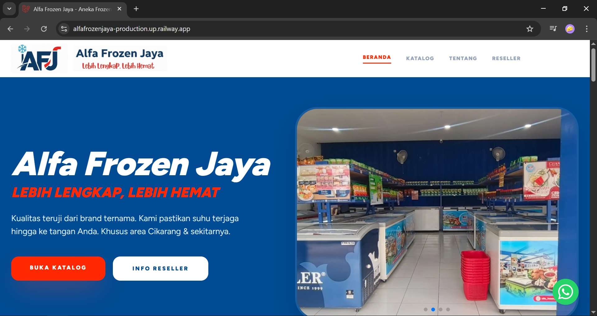
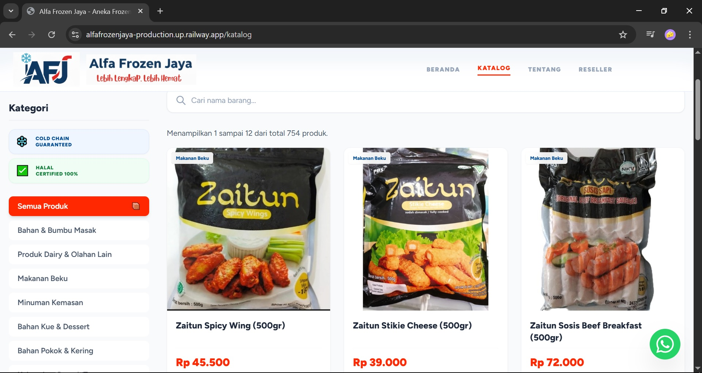
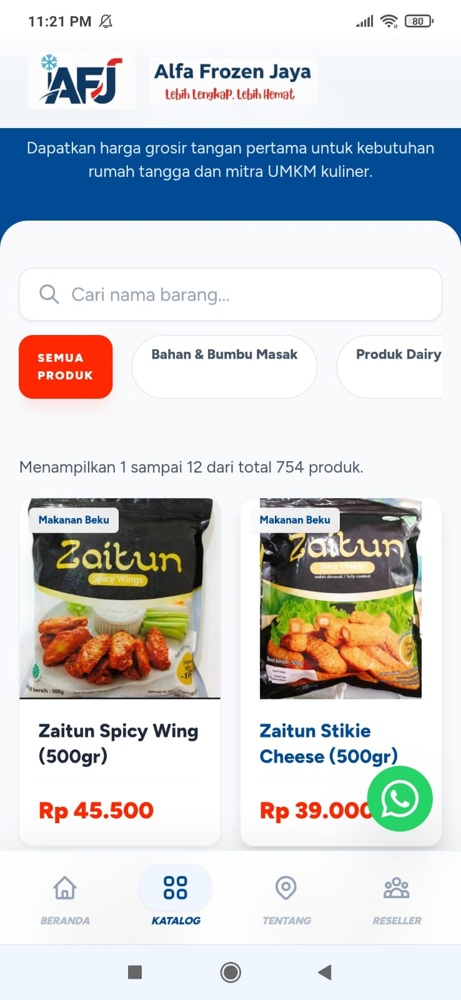
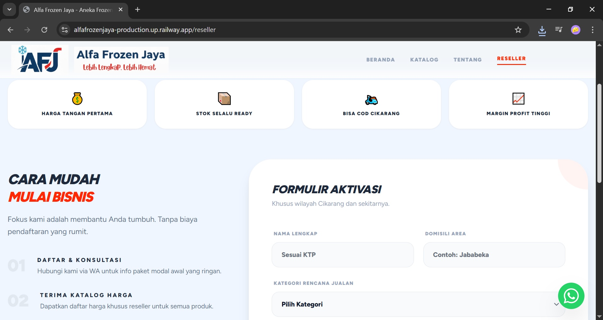
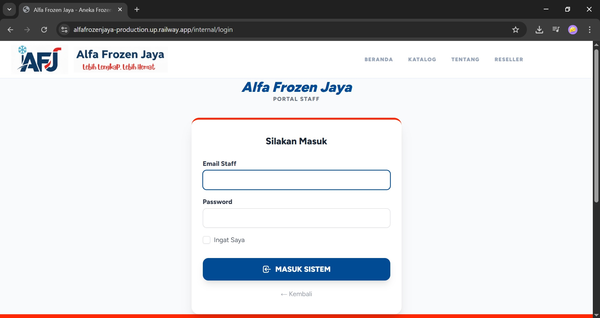
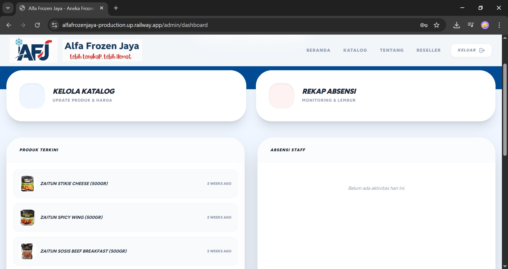
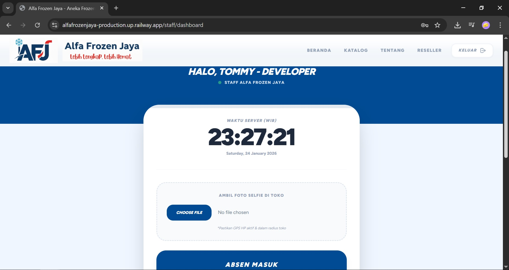

# Alfa Frozen Jaya (AFJ) - Digital Business Portal


---

## 📌 Project Overview

Alfa Frozen Jaya Digital Portal adalah aplikasi web berbasis Laravel yang dikembangkan dalam program Project Based Learning (PBL) / OJT BBPVP Bekasi untuk mendukung transformasi digital operasional mitra industri.

Proyek ini mengintegrasikan:

- 🌐 Digital Product Catalog (Customer Facing)
- 🧑‍💼 Web-based Attendance System (Internal Operations)

Tujuan utama proyek ini adalah menggantikan proses manual (price list & absensi kertas) menjadi sistem digital terstruktur yang mendukung efisiensi operasional dan integritas data.

---

## 🎯 Problem Statement

Sebelum implementasi sistem:
- Daftar harga produk masih dibagikan secara manual.
- Informasi produk tidak terpusat dan sulit diperbarui secara real-time.
- Absensi karyawan menggunakan pencatatan manual (rawan kesalahan & manipulasi).
- Tidak tersedia data terstruktur untuk kebutuhan pelaporan.

---

💡 Solution Architecture

Sistem dibangun menggunakan pendekatan MVC Laravel dengan pemisahan yang jelas antara:
- Layer Presentasi (Blade + Tailwind CSS)
- Layer Aplikasi (Controller & Validation)
- Layer Data (Eloquent ORM + MySQL)

High-Level Architecture
```
Client (Browser / Mobile)
↓
Laravel Routes
↓
Controllers
↓
Models (Eloquent ORM)
↓
MySQL Database
```

---

## 🌟 Core Features

### 1. Digital Product Catalog (Public)
* Real-time price display
  <br>
* Grid-based product listing
  <br>
* Responsive UI (Mobile-First)
  <br>
* Reseller registration landing page
  <br>
* Clean navigation (Desktop & Bottom Navbar Mobile)

Impact:

- Meningkatkan visibilitas produk
- Memberikan pengalaman browsing modern
- Memudahkan update harga & produk oleh admin

---

### 2. Attendance Management System (Internal)
* Secure authentication (Login-based access)
  <br>
* Admin dashboard monitoring
  <br>
* Clock-in / Clock-out digital logging
  <br>
* Centralized attendance records

Impact:

- Eliminasi pencatatan manual
- Data absensi tersimpan terstruktur
- Mempermudah rekap dan monitoring

---

## 🛠️ Tech Stack & Engineering Decisions
```
Layer	        Teknologi	            Alasan
Backend	        Laravel 10	            Struktur MVC solid, security built-in
Frontend	    Blade + Tailwind CSS	Rapid UI development
Interactivity	Alpine.js	            Lightweight reactive components
Database	    MySQL	                Relational integrity
ORM	            Eloquent	            Clean & expressive query building
```

Security Considerations
- CSRF Protection (Laravel built-in)
- Authentication middleware
- Form validation via Request validation
- Route protection untuk fitur internal

---

## 🚀 Installation Guide

### Prerequisites
* PHP >= 8.1
* Composer
* Node.js & NPM
* MySQL Server

### Langkah Instalasi

1. **Clone Repository**
    ```bash
    git clone [https://github.com/username/alfa-frozen-jaya-portal.git](https://github.com/username/alfa-frozen-jaya-portal.git)
    cd alfa-frozen-jaya-portal
    ```
2. **Install Dependencies**
    ```bash
    composer install
    npm install && npm run build
    ```
3. **Environment Configuration**
    ```bash
    cp .env.example .env
    php artisan key:generate
    ```
*Sesuaikan variabel DB_DATABASE, DB_USERNAME, dan DB_PASSWORD di file .env.*

4. **Database Migration & Seeding**
    ```bash
    php artisan migrate --seed
    ```
5. **Launch Server**
    ```bash
    php artisan serve
    ```
Akses aplikasi melalui: `http://localhost:8000`

---

## 📂 Project Structure Highlights
```
app/
 ├── Http/
 │    ├── Controllers/
 │    └── Middleware/
 ├── Models/
resources/
 ├── views/
 │    ├── components/
 │    └── layouts/
public/
 └── images/
database/
 ├── migrations/
 └── seeders/
```
---

## 👨‍💻 My Role & Contribution

Sebagai developer dalam proyek ini, saya:
- Mendesain struktur database dan relasi tabel
- Mengimplementasikan sistem autentikasi
- Mengembangkan fitur absensi digital
- Membangun UI responsif menggunakan Tailwind CSS
- Mengelola migrasi dan seeding database
- Mengintegrasikan validasi & proteksi route

---

## 📈 Learning Outcomes

Melalui proyek ini, saya memperdalam:
- Clean MVC architecture
- Database relational design
- Laravel authentication & middleware
- Form validation & data integrity
- Responsive UI development
- Real-world requirement translation menjadi sistem teknis

---

## 📄 Project Context
Proyek ini dikembangkan dalam program Project Based Learning (PBL) saat kegiatan On the Job Training (OJT)

* **Institusi:** BBPVP Bekasi
* **Mitra Industri:** Alfa Frozen Jaya
* * **Developer:** Tommy 

Penggunaan kode mengikuti kesepakatan institusi dan mitra industri.

---

**Maintained by:** Tommy ([@moriaren](https://github.com/moriaren))
